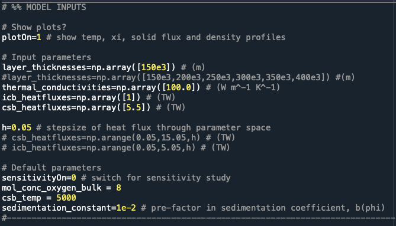
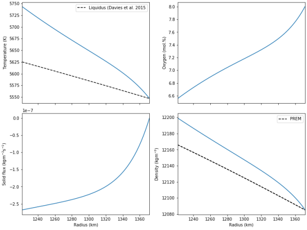

# nondim-slurry

Solve the 1D, steady, spherical slurry system outlined in Wong et al.
(in prep) (see also Wong et al. 2018).

## Getting Started

### Prerequisites
- [Git](https://git-scm.com)

### Installing

Download the latest version of the repository [here](https://github.com/jnywong/nondim-slurry).

### A simple example

1. Open `script_parametersearch.py`

2. Enter some input parameters. For example, try:

3. Run `script_parametersearch.py`

4. Admire the output:

## Built With

* [Python](https://www.python.org/) - Version 3.7.0

## Authors

* **Jenny Wong** - *Institut de Physique du Globe de Paris*
* **Chris Davies** - *University of Leeds*
* **Chris Jones** - *University of Leeds*

## License

This project is licensed under the MIT License - see the [license.md](license.md) file for details

## Acknowledgments

* Del Duca Foundation
* EPSRC Centre for Doctoral Training in Fluid Dynamics

:tada:
